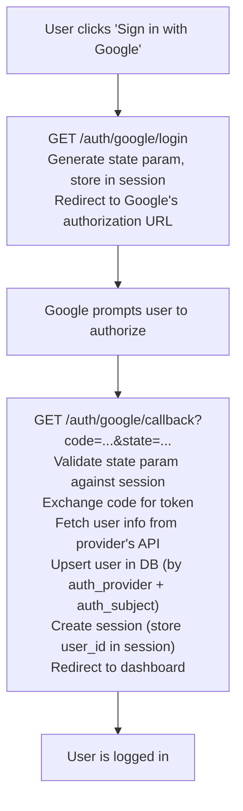
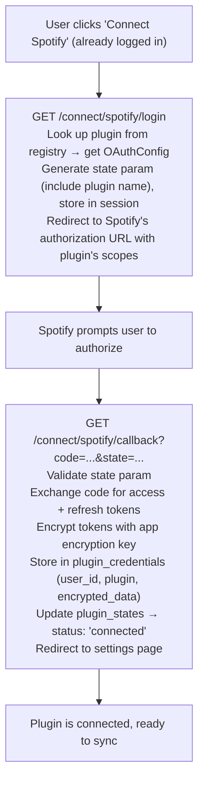
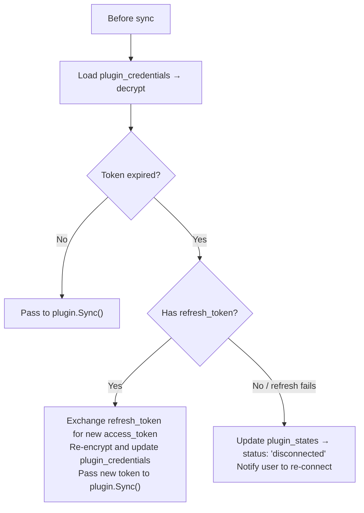

# Auth

## Overview

Two separate auth layers:

1. **App auth** — User logs in with Google or GitHub OAuth to create their account and session
2. **Plugin auth** — User connects platform accounts (Spotify, YouTube, etc.) via separate OAuth flows

These are independent. A user logs in with GitHub (app auth) but connects their
Google account for YouTube (plugin auth).

---

## Stack

Based on the project's Go web template:

| Component | Library | Purpose |
|-----------|---------|---------|
| Router | `go-chi/chi` | Route groups, middleware |
| Sessions | `gorilla/sessions` + PostgreSQL store | Server-side sessions via HTTP-only cookies |
| CSRF | `gorilla/csrf` | CSRF protection on all mutating requests |
| OAuth | `golang.org/x/oauth2` | OAuth 2.0 flows for app login + plugin connections |
| DB | `jackc/pgx/v5` | PostgreSQL driver |
| Queries | `sqlc` | Type-safe SQL |
| Encryption | `crypto/aes` (stdlib) | AES-256-GCM for plugin credential encryption |

---

## App Auth (User Accounts)

### Supported Providers

| Provider | OAuth Endpoints | Scopes |
|----------|----------------|--------|
| **Google** | `accounts.google.com/o/oauth2/v2/auth` / `oauth2.googleapis.com/token` | `openid email profile` |
| **GitHub** | `github.com/login/oauth/authorize` / `github.com/login/oauth/access_token` | `read:user user:email` |

### Flow



### User Info Endpoints

After token exchange, fetch user info:

- **Google**: `GET https://www.googleapis.com/oauth2/v2/userinfo`
  → `{ id, email, name, picture }`
- **GitHub**: `GET https://api.github.com/user` + `GET https://api.github.com/user/emails`
  → `{ id, login, name, avatar_url }` + primary email

### Routes

```go
r.Route("/auth", func(r chi.Router) {
    // App login
    r.Get("/google/login", handlers.GoogleLogin)
    r.Get("/google/callback", handlers.GoogleCallback)
    r.Get("/github/login", handlers.GithubLogin)
    r.Get("/github/callback", handlers.GithubCallback)
    r.Post("/logout", handlers.Logout)
})
```

### Session Management

Server-side sessions stored in PostgreSQL:

```sql
CREATE TABLE sessions (
    id         TEXT PRIMARY KEY,           -- session token (random, URL-safe)
    user_id    UUID NOT NULL REFERENCES users(id) ON DELETE CASCADE,
    data       JSONB DEFAULT '{}',         -- session data (minimal — just user_id)
    expires_at TIMESTAMPTZ NOT NULL,
    created_at TIMESTAMPTZ NOT NULL DEFAULT now()
);

CREATE INDEX idx_sessions_expires ON sessions(expires_at);
```

- **Cookie**: `session_id`, HTTP-only, Secure (production), SameSite=Lax, Path=/
- **Expiry**: 30 days, rolling (extended on activity)
- **Cleanup**: Periodic job deletes expired sessions

### Auth Middleware

```go
// RequireAuth middleware — protect all authenticated routes
func RequireAuth(sessionStore SessionStore) func(http.Handler) http.Handler {
    return func(next http.Handler) http.Handler {
        return http.HandlerFunc(func(w http.ResponseWriter, r *http.Request) {
            sessionID, err := r.Cookie("session_id")
            if err != nil {
                http.Redirect(w, r, "/login", http.StatusFound)
                return
            }

            session, err := sessionStore.Get(r.Context(), sessionID.Value)
            if err != nil || session.IsExpired() {
                http.Redirect(w, r, "/login", http.StatusFound)
                return
            }

            // Add user_id to request context
            ctx := context.WithValue(r.Context(), userIDKey, session.UserID)
            next.ServeHTTP(w, r.WithContext(ctx))
        })
    }
}
```

### Route Structure

```go
r.Group(func(r chi.Router) {
    // Public routes
    r.Get("/login", handlers.LoginPage)
    r.Get("/auth/google/login", handlers.GoogleLogin)
    r.Get("/auth/google/callback", handlers.GoogleCallback)
    r.Get("/auth/github/login", handlers.GithubLogin)
    r.Get("/auth/github/callback", handlers.GithubCallback)
    r.Get("/share/{slug}", handlers.PublicProfile)      // shareable profiles (no auth)
})

r.Group(func(r chi.Router) {
    // Authenticated routes
    r.Use(RequireAuth(sessionStore))
    r.Use(csrfMw)

    r.Get("/", handlers.Dashboard)
    r.Get("/settings", handlers.Settings)
    r.Post("/auth/logout", handlers.Logout)

    // Plugin connection routes
    r.Get("/connect/{plugin}/login", handlers.PluginOAuthLogin)
    r.Get("/connect/{plugin}/callback", handlers.PluginOAuthCallback)
    r.Post("/connect/{plugin}/import", handlers.PluginFileImport)
    r.Post("/connect/{plugin}/disconnect", handlers.PluginDisconnect)

    // Sync
    r.Post("/sync/{plugin}", handlers.SyncPlugin)

    // API (JSON responses for HTMX)
    r.Route("/api", func(r chi.Router) {
        r.Get("/insights", handlers.Insights)
        r.Get("/timeline", handlers.Timeline)
        // ...
    })
})
```

---

## Plugin Auth (Platform Connections)

### Flow



### Generic Plugin OAuth Handler

The server doesn't know about individual providers — it uses the plugin's `OAuthConfig()`:

```go
func PluginOAuthLogin(w http.ResponseWriter, r *http.Request) {
    pluginName := chi.URLParam(r, "plugin")
    plugin := registry.Get(pluginName)

    oauthCfg := plugin.AuthConfig()
    if oauthCfg == nil {
        http.Error(w, "plugin does not use OAuth", 400)
        return
    }

    cfg := &oauth2.Config{
        ClientID:     config.PluginClientID(pluginName),
        ClientSecret: config.PluginClientSecret(pluginName),
        Endpoint: oauth2.Endpoint{
            AuthURL:  oauthCfg.AuthURL,
            TokenURL: oauthCfg.TokenURL,
        },
        Scopes:      oauthCfg.Scopes,
        RedirectURL: config.BaseURL + "/connect/" + pluginName + "/callback",
    }

    state := generateState(pluginName)
    storeStateInSession(r, state)
    http.Redirect(w, r, cfg.AuthCodeURL(state), http.StatusFound)
}
```

### File Import Plugins

No OAuth flow. User uploads a file directly:

```go
// POST /connect/{plugin}/import
func PluginFileImport(w http.ResponseWriter, r *http.Request) {
    pluginName := chi.URLParam(r, "plugin")
    file, _, err := r.FormFile("file")
    // ... validate, pass to plugin.Sync() with file in Credentials
}
```

---

## Token Encryption

Plugin credentials (OAuth tokens, API keys) are encrypted at rest.

### Encryption Scheme

- **Algorithm**: AES-256-GCM (authenticated encryption)
- **Key**: 32-byte key from environment variable `ENCRYPTION_KEY`
- **Nonce**: Random 12-byte nonce per encryption, prepended to ciphertext

```go
package crypto

import (
    "crypto/aes"
    "crypto/cipher"
    "crypto/rand"
    "io"
)

func Encrypt(plaintext, key []byte) ([]byte, error) {
    block, err := aes.NewCipher(key)
    if err != nil {
        return nil, err
    }

    gcm, err := cipher.NewGCM(block)
    if err != nil {
        return nil, err
    }

    nonce := make([]byte, gcm.NonceSize())
    if _, err := io.ReadFull(rand.Reader, nonce); err != nil {
        return nil, err
    }

    return gcm.Seal(nonce, nonce, plaintext, nil), nil
}

func Decrypt(ciphertext, key []byte) ([]byte, error) {
    block, err := aes.NewCipher(key)
    if err != nil {
        return nil, err
    }

    gcm, err := cipher.NewGCM(block)
    if err != nil {
        return nil, err
    }

    nonceSize := gcm.NonceSize()
    nonce, ciphertext := ciphertext[:nonceSize], ciphertext[nonceSize:]
    return gcm.Open(nil, nonce, ciphertext, nil)
}
```

### What Gets Encrypted

The `plugin_credentials.encrypted_data` column stores an encrypted JSON blob:

```json
{
  "access_token": "BQD...",
  "refresh_token": "AQA...",
  "token_type": "Bearer",
  "expiry": "2025-03-11T12:00:00Z"
}
```

Decrypted only when:
- Passing credentials to `plugin.Sync()` or `plugin.Enrich()`
- Refreshing an expired OAuth token

### Token Refresh



### Key Rotation

To rotate the encryption key:

1. Set `ENCRYPTION_KEY_OLD` to the current key
2. Set `ENCRYPTION_KEY` to the new key
3. Run migration: decrypt all credentials with old key, re-encrypt with new key
4. Remove `ENCRYPTION_KEY_OLD`

---

## Environment Variables

```bash
# App OAuth (login)
GOOGLE_CLIENT_ID=...
GOOGLE_CLIENT_SECRET=...
GITHUB_CLIENT_ID=...
GITHUB_CLIENT_SECRET=...

# Session
SESSION_SECRET=...                 # 32+ bytes, for cookie signing
CSRF_KEY=...                       # exactly 32 bytes

# Plugin OAuth (platform connections)
SPOTIFY_CLIENT_ID=...
SPOTIFY_CLIENT_SECRET=...
YOUTUBE_CLIENT_ID=...
YOUTUBE_CLIENT_SECRET=...

# Encryption
ENCRYPTION_KEY=...                 # exactly 32 bytes, for plugin credential encryption

# App
BASE_URL=https://yourapp.com       # for OAuth redirect URLs
DATABASE_URL=postgres://...
```

---

## Security Considerations

| Concern | Mitigation |
|---------|-----------|
| CSRF | `gorilla/csrf` on all mutating routes. Token injected via templ components. |
| Session fixation | Generate new session ID on login. |
| Token theft | Plugin credentials encrypted at rest. Sessions are server-side (no JWTs with embedded secrets). |
| OAuth state | Random state param validated on callback. Stored in session, not URL. |
| Cookie security | HTTP-only, Secure (production), SameSite=Lax. |
| SQL injection | sqlc generates parameterized queries. No raw string concatenation. |
| XSS | Templ auto-escapes output. CSP headers recommended. |
