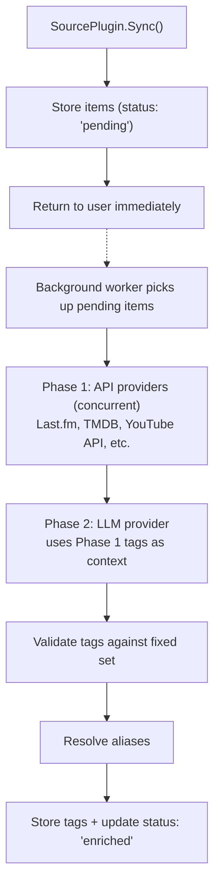

# Enrichment Pipeline

## Overview

Enrichment is handled by **EnrichmentProviders** — a separate plugin type from
SourcePlugins. Source plugins import data (`Sync()`), enrichment providers add
metadata (`Enrich()`). Multiple providers can enrich the same items.

Providers are registered at startup and run automatically by a background worker.
Each provider declares which media types and platforms it supports. If a provider's
required API key is not configured, it is simply not registered.

### Provider types

- **API providers** — Call external platform APIs (Last.fm, TMDB, YouTube Data API,
  Open Library, AniList, IGDB). Add authoritative tags with
  confidence `NULL` (meaning "certain").
- **LLM provider** — Universal Genkit-based classification. Fills gaps (mood, topic).
  Tags stored with confidence 0.0–1.0. Runs **after** API providers so it can use
  their tags as context.

---

## Tag Taxonomy

### Fixed Tag Set (MVP)

Tags are a **fixed, predefined set**. Enrichers can only assign tags from this list —
no runtime tag creation. This ensures deterministic insights and avoids tag soup.

Four categories, each with a curated set of tags:

#### Genre

```
rock, pop, hip-hop, r-and-b, jazz, classical, electronic, country, folk, metal,
punk, indie, latin, reggae, blues, soul, funk, ambient, alternative,
comedy, drama, thriller, horror, sci-fi, fantasy, romance, documentary,
animation, action, adventure, mystery, crime, western, musical,
literary-fiction, non-fiction, memoir, self-help, biography, poetry,
true-crime, news, interview, panel, narrative
```

#### Topic

```
science, technology, politics, history, philosophy, psychology, economics,
health, fitness, cooking, travel, nature, environment, education, art,
music-theory, film-criticism, gaming, sports, business, entrepreneurship,
relationships, parenting, spirituality, mathematics, engineering, design,
social-media, pop-culture, current-events, language, literature, space,
ai, programming, data, security, finance, real-estate, fashion, automotive
```

#### Mood

```
energetic, melancholic, chill, dark, uplifting, aggressive, romantic,
nostalgic, anxious, peaceful, funny, serious, inspirational, eerie,
intense, dreamy, playful, raw, contemplative, triumphant
```

#### Format

```
album-track, single, ep-track, live-recording, remix, cover,
film, series, mini-series, short-film, music-video, livestream,
episode, clip, trailer, compilation,
novel, short-story, essay, collection, graphic-novel,
podcast-episode, podcast-series, audiobook
```

### Expanding the Tag Set

To add new tags post-MVP:
1. Add to the canonical list in config/code
2. Run a re-enrichment pass on existing items (LLM can now assign the new tag)
3. Tag aliases still apply — map variant spellings to canonical names

---

## EnrichmentProvider Interface

```go
type EnrichmentProvider interface {
    Name() string
    Supports(mediaType string, platform string) bool
    Enrich(ctx context.Context, items []MediaItem) ([]MediaItem, error)
}
```

- `Supports()` — Returns true if this provider can enrich items of the given type/platform.
- `Enrich()` — Takes a batch of items, returns enriched items. Errors should be `*PluginError`
  with appropriate codes (rate_limit, upstream, auth_expired, invalid_data).
- Each provider batches internally according to its API's capabilities.

### Registered providers

| Provider | Supports | What It Adds |
|----------|----------|-------------|
| **Last.fm** | music (any platform) | genre tags (freeform → mapped to fixed set) |
| **MusicBrainz** | music (any platform) | genre tags (curated), duration validation |
| **YouTube Data API** | video (youtube) | genre, topic, format, duration, view counts |
| **TMDB** | video (netflix, prime-video, etc.) | genre, format, runtime, ratings |
| **Open Library** | book (any platform) | genre, topic, format |

| **AniList** | anime, manga (any platform) | genre, topic |
| **IGDB** | game (any platform) | genre, topic |
| **LLM (Genkit)** | all types, all platforms | mood, topic (fills gaps after API providers) |

---

## Enrichment Sources

### Last.fm (music)

- **API**: `http://ws.audioscrobbler.com/2.0/`
- **Auth**: API key (free, instant at [last.fm/api](https://www.last.fm/api/account/create))
- **Key endpoints**:
  - `track.getTopTags` — tags for a specific track
  - `artist.getTopTags` — tags for an artist
- **Rate limit**: 5 requests/second
- **Batch strategy**: Dedupe by artist — fetch artist tags once, apply to all tracks
  by that artist. Then per-track for popular/divergent tracks.
- **Tag mapping**: Last.fm returns freeform tags. Map to fixed set via fuzzy matching
  (e.g., "Hip Hop" → `hip-hop`, "electronic music" → `electronic`). Unmatched tags
  are discarded.

### MusicBrainz (music)

- **API**: `https://musicbrainz.org/ws/2/`
- **Auth**: None (just `User-Agent` header)
- **Key endpoints**:
  - `recording?query=artist:X AND recording:Y&inc=genres`
  - `release-group/{id}?inc=genres`
- **Rate limit**: 1 request/second (strict)
- **Note**: High-quality curated genres. Use as secondary to validate Last.fm tags.

### TMDB (movies, TV shows)

- **API**: `https://api.themoviedb.org/3/`
- **Auth**: API key (free at [themoviedb.org](https://www.themoviedb.org/settings/api))
- **Key endpoints**:
  - `search/movie?query=X` / `search/tv?query=X`
  - `movie/{id}` / `tv/{id}` — genres, keywords, overview
- **Rate limit**: ~40 requests per 10 seconds
- **Matching**: Search by title, filter by year if available. Store TMDB ID in
  `raw_metadata` for future lookups.

### OMDB (movies, TV shows — supplementary)

- **API**: `http://www.omdbapi.com/`
- **Auth**: API key (free tier: 1,000 requests/day)
- **Use case**: Ratings data (IMDb, RT, Metacritic) stored in `raw_metadata`.
  Not used for genre tagging.

### Open Library (books)

- **API**: `https://openlibrary.org/`
- **Auth**: None
- **Key endpoints**:
  - `search.json?title=X&author=Y`
  - `works/{id}.json` — subjects
- **Tag mapping**: Subjects are freeform. Map to fixed genre/topic set via fuzzy matching.

### YouTube Data API (videos)

- **API**: `https://www.googleapis.com/youtube/v3/`
- **Auth**: OAuth (same token as sync)
- **Key endpoint**: `videos?id=ID1,ID2,...&part=snippet,contentDetails,topicDetails`
- **Quota**: 1 unit per call, 50 IDs per call, 10K units/day
- **Output**: `categoryId`, `topicDetails.topicCategories` (Wikipedia URLs), `tags`

### AniList (anime, manga)

- **API**: `https://graphql.anilist.co` (GraphQL)
- **Auth**: None required
- **Key query**: `Media(search: "title", type: ANIME)` → genres, tags, episodes, duration, averageScore
- **Rate limit**: 90 requests/minute
- **Output**: 19 curated genres + hundreds of community-ranked tags with vote counts

### IGDB (games)

- **API**: `https://api.igdb.com/v4/`
- **Auth**: Twitch client credentials (free at [dev.twitch.tv](https://dev.twitch.tv/console))
- **Key endpoints**:
  - `games` — search by name, returns genres, themes, game modes, platforms
  - `genres`, `themes` — taxonomy lookups
- **Rate limit**: 4 requests/second
- **Output**: ~25 genres + ~20 themes (structured taxonomy)

---

## Core LLM Enricher

### Genkit (Go)

Using **Genkit** (`github.com/firebase/genkit/go`) for provider-agnostic LLM access
with native structured output:

```go
import (
    "github.com/firebase/genkit/go/ai"
    "github.com/firebase/genkit/go/genkit"
    // Provider plugins
    "github.com/firebase/genkit/go/plugins/googlegenai"
    "github.com/firebase/genkit/go/plugins/ollama"
)
```

Supports Google (Gemini), OpenAI, Anthropic, and **Ollama** (local models) through
a unified interface. Provider is configurable per deployment.

### Structured Output

Use `genkit.GenerateData[T]()` with Go generics for type-safe tag output:

```go
type TagResult struct {
    Genre  []string `json:"genre"`
    Topic  []string `json:"topic"`
    Mood   []string `json:"mood"`
    Format string   `json:"format"`
}

result, _, err := genkit.GenerateData[TagResult](ctx, g,
    ai.WithModel(model),
    ai.WithPrompt(buildTagPrompt(item, existingTags)),
)
// result is already typed as TagResult — no JSON unmarshaling needed
```

### Prompt Design

```
Classify this media item by selecting tags from the allowed sets below.

Item:
- Platform: spotify
- Type: music
- Title: "Everything In Its Right Place"
- Creator: "Radiohead"
- Existing tags: [alternative, rock] (from plugin enrichment)

Allowed tags:
- genre: [rock, pop, hip-hop, electronic, indie, alternative, ...]
- topic: [science, technology, politics, ...]
- mood: [energetic, melancholic, chill, dark, ...]
- format: [album-track, single, ep-track, live-recording, ...]

Rules:
- ONLY use tags from the allowed lists above
- Select 1-3 tags per category
- Return empty array for a category if nothing fits confidently
- Use existing tags as context but don't repeat them

Respond as JSON: {"genre": [...], "topic": [...], "mood": [...], "format": "..."}
```

### Validation

After LLM response, core validates that every returned tag exists in the fixed set.
Any tag not in the set is **silently dropped** — this handles hallucinated tags.

### Confidence Scores

LLM-generated tags are stored with `confidence` in `media_item_tags`:
- Default confidence: `0.8` for LLM tags
- Plugin-sourced (authoritative) tags: `NULL` (meaning certain)
- Insights queries can filter by `confidence >= threshold`

### Provider Configuration

```yaml
enrichment:
  llm:
    provider: "googlegenai"     # googlegenai | openai | anthropic | ollama
    model: "gemini-2.0-flash"   # cost-effective for classification
    # For Ollama (local):
    # provider: "ollama"
    # model: "llama3.1:8b"
    # base_url: "http://localhost:11434"
    batch_size: 10              # items per LLM call
    max_concurrent: 3           # parallel LLM requests
```

**Cost estimation** (Gemini 2.0 Flash):
- ~200 tokens per classification prompt + response
- Very low cost at Google's pricing
- Ollama: free, ~2-5 sec per item on decent hardware

---

## Enrichment Flow

### Architecture

Enrichment is **async** — decoupled from the sync request:

1. `SourcePlugin.Sync()` imports items → stored with `enrichment_status = 'pending'`
2. Sync returns immediately to the user
3. Background worker (goroutine with `time.Ticker`) polls for pending items
4. Worker runs matching providers in two phases:
   - **Phase 1**: API providers (concurrently) — Last.fm, TMDB, YouTube API, etc.
   - **Phase 2**: LLM provider — uses Phase 1 tags as context
5. Tags validated against fixed set, aliases resolved, status updated



### Worker Details

- Polls every 5 seconds with `time.Ticker`
- Pulls ~50 pending items per tick: `SELECT ... WHERE enrichment_status = 'pending' LIMIT 50 FOR UPDATE SKIP LOCKED`
- Postgres row locking handles concurrency (safe for multiple instances)
- No external queue or pub/sub needed

### Status Transitions

```
pending → enriching → enriched
                    → failed (after 3 retries)
```

### Error Handling

Providers return `*PluginError` with error codes. The worker responds per code:

| Error Code | Worker Action |
|------------|--------------|
| `rate_limit` | Back off for `After` duration, skip provider this tick, retry next tick |
| `auth_expired` | Skip provider until credentials refreshed |
| `upstream` | Retry with exponential backoff (max 3 attempts) |
| `invalid_data` | Log and skip — item can't be parsed by this provider |

Per-item retry count (max 3). After 3 failures → `failed`. Re-enrichment resets
status to `pending` (triggered via API endpoint or settings UI).

---

## Tag Alias Resolution

Before persisting, tag strings are resolved through the `tag_aliases` table:

```
"hip hop"    → alias → canonical: "hip-hop"
"Hip-Hop"    → alias → canonical: "hip-hop"
"sci fi"     → alias → canonical: "sci-fi"
"electronic" → no alias, exists in fixed set → use directly
"vaporwave"  → not in fixed set → discard
```

---

## Batch Processing

| Source | Batch Strategy |
|--------|---------------|
| Last.fm | Dedupe by artist → 1 req per unique artist, then per-track |
| MusicBrainz | 1 req per item (1/sec rate limit) |
| TMDB | 1 search per item, cache TMDB IDs |
| YouTube API | 50 video IDs per request |
| Open Library | 1 search per book, cache work IDs |
| LLM | 5-10 items per prompt (list classification) |

---

## Configuration

All configuration via environment variables, consistent with the rest of the app.
Providers are only registered if their required env vars are set.

```bash
# API enrichment providers (set to register, omit to skip)
LASTFM_API_KEY=xxx
TMDB_API_KEY=xxx
OMDB_API_KEY=xxx                    # optional, supplements TMDB

IGDB_CLIENT_ID=xxx
IGDB_CLIENT_SECRET=xxx

# LLM enrichment provider
LLM_PROVIDER=googlegenai            # googlegenai | openai
LLM_MODEL=gemini-2.5-flash
LLM_API_KEY=xxx
LLM_BASE_URL=                       # custom endpoint for openai provider
                                    # e.g. https://opencode.ai/zen/v1/ for OpenCode Zen
                                    # e.g. http://localhost:11434/v1/ for Ollama

# Worker settings (optional, sensible defaults)
ENRICHMENT_BATCH_SIZE=50            # items per worker tick
ENRICHMENT_POLL_INTERVAL=5s         # how often worker checks for pending items
ENRICHMENT_MAX_RETRIES=3            # per-item retry limit
ENRICHMENT_MIN_CONFIDENCE=0.7       # tag confidence threshold for insights
```

Providers are wired in `main.go` — each constructor takes its config as parameters.
No config file, no YAML.
