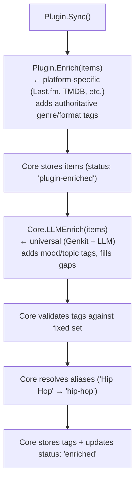

# Enrichment Pipeline

## Overview

Enrichment is split into two layers:

1. **Plugin enrichment** — Each plugin enriches its own items using platform-specific
   sources (Spotify plugin calls Last.fm, Netflix plugin calls TMDB). Lives in the plugin.
2. **Core enrichment** — Universal LLM-based classification that runs on ALL items
   after plugin enrichment. Lives in core. Also handles tag validation and alias resolution.

This keeps plugins self-contained (fetch + normalize + enrich) while core stays slim
(just the LLM tagger and tag management).

---

## Tag Taxonomy

### Fixed Tag Set (MVP)

Tags are a **fixed, predefined set**. Enrichers can only assign tags from this list —
no runtime tag creation. This ensures deterministic insights and avoids tag soup.

Four categories, each with a curated set of tags:

#### Genre

```
rock, pop, hip-hop, r-and-b, jazz, classical, electronic, country, folk, metal,
punk, indie, latin, reggae, blues, soul, funk, ambient, alternative,
comedy, drama, thriller, horror, sci-fi, fantasy, romance, documentary,
animation, action, adventure, mystery, crime, western, musical,
literary-fiction, non-fiction, memoir, self-help, biography, poetry,
true-crime, news, interview, panel, narrative
```

#### Topic

```
science, technology, politics, history, philosophy, psychology, economics,
health, fitness, cooking, travel, nature, environment, education, art,
music-theory, film-criticism, gaming, sports, business, entrepreneurship,
relationships, parenting, spirituality, mathematics, engineering, design,
social-media, pop-culture, current-events, language, literature, space,
ai, programming, data, security, finance, real-estate, fashion, automotive
```

#### Mood

```
energetic, melancholic, chill, dark, uplifting, aggressive, romantic,
nostalgic, anxious, peaceful, funny, serious, inspirational, eerie,
intense, dreamy, playful, raw, contemplative, triumphant
```

#### Format

```
album-track, single, ep-track, live-recording, remix, cover,
film, series, mini-series, short-film, music-video, livestream,
episode, clip, trailer, compilation,
novel, short-story, essay, collection, graphic-novel,
podcast-episode, podcast-series, audiobook
```

### Expanding the Tag Set

To add new tags post-MVP:
1. Add to the canonical list in config/code
2. Run a re-enrichment pass on existing items (LLM can now assign the new tag)
3. Tag aliases still apply — map variant spellings to canonical names

---

## Two-Layer Enrichment

### Layer 1: Plugin Enrichment (platform-specific)

Each plugin's `Enrich()` method calls external APIs specific to that content type.
The plugin knows its domain best.

| Plugin | Enrichment Sources | What It Adds |
|--------|-------------------|-------------|
| **Spotify** | Last.fm (track/artist tags), MusicBrainz (genres) | genre, format |
| **YouTube** | YouTube Data API (categories, topic details) | genre, topic, format |
| **Netflix** | TMDB (search by title → genres, keywords) | genre, format |
| **Prime Video** | TMDB + OMDB (ratings → raw_metadata) | genre, format |
| **Goodreads** | Open Library (subjects → genre/topic) | genre, topic, format |
| **TikTok** | TikTok oEmbed (title, author) | minimal — relies on LLM |
| **Podcasts** | Spotify API (show categories) | genre, topic |

Plugin enrichment adds **authoritative tags with confidence `NULL`** (meaning "certain").

### Layer 2: Core Enrichment (universal LLM)

After plugin enrichment, core runs the LLM enricher on all items. It:
- Fills gaps — adds mood and topic tags that platform APIs don't provide
- Works with what plugin enrichment already added as context
- Only assigns from the **fixed tag set**
- Tags stored with a `confidence` score (0.0–1.0)

---

## Plugin Enrichment Sources

### Last.fm (used by Spotify plugin)

- **API**: `http://ws.audioscrobbler.com/2.0/`
- **Auth**: API key (free, instant at [last.fm/api](https://www.last.fm/api/account/create))
- **Key endpoints**:
  - `track.getTopTags` — tags for a specific track
  - `artist.getTopTags` — tags for an artist
- **Rate limit**: 5 requests/second
- **Batch strategy**: Dedupe by artist — fetch artist tags once, apply to all tracks
  by that artist. Then per-track for popular/divergent tracks.
- **Tag mapping**: Last.fm returns freeform tags. Map to fixed set via fuzzy matching
  (e.g., "Hip Hop" → `hip-hop`, "electronic music" → `electronic`). Unmatched tags
  are discarded.

### MusicBrainz (used by Spotify plugin)

- **API**: `https://musicbrainz.org/ws/2/`
- **Auth**: None (just `User-Agent` header)
- **Key endpoints**:
  - `recording?query=artist:X AND recording:Y&inc=genres`
  - `release-group/{id}?inc=genres`
- **Rate limit**: 1 request/second (strict)
- **Note**: High-quality curated genres. Use as secondary to validate Last.fm tags.

### TMDB (used by Netflix, Prime Video plugins)

- **API**: `https://api.themoviedb.org/3/`
- **Auth**: API key (free at [themoviedb.org](https://www.themoviedb.org/settings/api))
- **Key endpoints**:
  - `search/movie?query=X` / `search/tv?query=X`
  - `movie/{id}` / `tv/{id}` — genres, keywords, overview
- **Rate limit**: ~40 requests per 10 seconds
- **Matching**: Search by title, filter by year if available. Store TMDB ID in
  `raw_metadata` for future lookups.

### OMDB (used by Prime Video plugin, optional)

- **API**: `http://www.omdbapi.com/`
- **Auth**: API key (free tier: 1,000 requests/day)
- **Use case**: Ratings data (IMDb, RT, Metacritic) stored in `raw_metadata`.
  Not used for genre tagging.

### Open Library (used by Goodreads plugin)

- **API**: `https://openlibrary.org/`
- **Auth**: None
- **Key endpoints**:
  - `search.json?title=X&author=Y`
  - `works/{id}.json` — subjects
- **Tag mapping**: Subjects are freeform. Map to fixed genre/topic set via fuzzy matching.

### YouTube Data API (used by YouTube plugin)

- **API**: `https://www.googleapis.com/youtube/v3/`
- **Auth**: OAuth (same token as sync)
- **Key endpoint**: `videos?id=ID1,ID2,...&part=snippet,contentDetails,topicDetails`
- **Quota**: 1 unit per call, 50 IDs per call, 10K units/day
- **Output**: `categoryId`, `topicDetails.topicCategories` (Wikipedia URLs), `tags`

### TikTok oEmbed (used by TikTok plugin)

- **API**: `https://www.tiktok.com/oembed?url=VIDEO_URL`
- **Auth**: None
- **Output**: Title, author name, thumbnail URL
- **Note**: Very sparse. TikTok items rely heavily on LLM enrichment.

---

## Core LLM Enricher

### Genkit (Go)

Using **Genkit** (`github.com/firebase/genkit/go`) for provider-agnostic LLM access
with native structured output:

```go
import (
    "github.com/firebase/genkit/go/ai"
    "github.com/firebase/genkit/go/genkit"
    // Provider plugins
    "github.com/firebase/genkit/go/plugins/googlegenai"
    "github.com/firebase/genkit/go/plugins/ollama"
)
```

Supports Google (Gemini), OpenAI, Anthropic, and **Ollama** (local models) through
a unified interface. Provider is configurable per deployment.

### Structured Output

Use `genkit.GenerateData[T]()` with Go generics for type-safe tag output:

```go
type TagResult struct {
    Genre  []string `json:"genre"`
    Topic  []string `json:"topic"`
    Mood   []string `json:"mood"`
    Format string   `json:"format"`
}

result, _, err := genkit.GenerateData[TagResult](ctx, g,
    ai.WithModel(model),
    ai.WithPrompt(buildTagPrompt(item, existingTags)),
)
// result is already typed as TagResult — no JSON unmarshaling needed
```

### Prompt Design

```
Classify this media item by selecting tags from the allowed sets below.

Item:
- Platform: spotify
- Type: music
- Title: "Everything In Its Right Place"
- Creator: "Radiohead"
- Existing tags: [alternative, rock] (from plugin enrichment)

Allowed tags:
- genre: [rock, pop, hip-hop, electronic, indie, alternative, ...]
- topic: [science, technology, politics, ...]
- mood: [energetic, melancholic, chill, dark, ...]
- format: [album-track, single, ep-track, live-recording, ...]

Rules:
- ONLY use tags from the allowed lists above
- Select 1-3 tags per category
- Return empty array for a category if nothing fits confidently
- Use existing tags as context but don't repeat them

Respond as JSON: {"genre": [...], "topic": [...], "mood": [...], "format": "..."}
```

### Validation

After LLM response, core validates that every returned tag exists in the fixed set.
Any tag not in the set is **silently dropped** — this handles hallucinated tags.

### Confidence Scores

LLM-generated tags are stored with `confidence` in `media_item_tags`:
- Default confidence: `0.8` for LLM tags
- Plugin-sourced (authoritative) tags: `NULL` (meaning certain)
- Insights queries can filter by `confidence >= threshold`

### Provider Configuration

```yaml
enrichment:
  llm:
    provider: "googlegenai"     # googlegenai | openai | anthropic | ollama
    model: "gemini-2.0-flash"   # cost-effective for classification
    # For Ollama (local):
    # provider: "ollama"
    # model: "llama3.1:8b"
    # base_url: "http://localhost:11434"
    batch_size: 10              # items per LLM call
    max_concurrent: 3           # parallel LLM requests
```

**Cost estimation** (Gemini 2.0 Flash):
- ~200 tokens per classification prompt + response
- Very low cost at Google's pricing
- Ollama: free, ~2-5 sec per item on decent hardware

---

## Enrichment Flow

### Per-Item Flow



### Error Handling

- Plugin enrichment failure → items stored without plugin tags, LLM still runs
- LLM failure → items keep plugin tags only, status set to `"plugin-enriched"`
  (retry LLM later)
- Both fail → status stays `"pending"` for full retry
- Rate limit errors → backoff for that source only, don't block other items

---

## Tag Alias Resolution

Before persisting, tag strings are resolved through the `tag_aliases` table:

```
"hip hop"    → alias → canonical: "hip-hop"
"Hip-Hop"    → alias → canonical: "hip-hop"
"sci fi"     → alias → canonical: "sci-fi"
"electronic" → no alias, exists in fixed set → use directly
"vaporwave"  → not in fixed set → discard
```

---

## Batch Processing

| Source | Batch Strategy |
|--------|---------------|
| Last.fm | Dedupe by artist → 1 req per unique artist, then per-track |
| MusicBrainz | 1 req per item (1/sec rate limit) |
| TMDB | 1 search per item, cache TMDB IDs |
| YouTube API | 50 video IDs per request |
| Open Library | 1 search per book, cache work IDs |
| LLM | 5-10 items per prompt (list classification) |

---

## Configuration

```yaml
enrichment:
  enabled: true
  llm:
    provider: "googlegenai"
    model: "gemini-2.0-flash"
    api_key: "${GENAI_API_KEY}"
    batch_size: 10
    max_concurrent: 3
  # Tag confidence threshold for insights
  min_confidence: 0.7
  # Plugin-level enrichment API keys (used by respective plugins)
  api_keys:
    lastfm: "${LASTFM_API_KEY}"
    tmdb: "${TMDB_API_KEY}"
    omdb: "${OMDB_API_KEY}"
```

Note: Plugin enrichment sources (Last.fm, TMDB, etc.) are configured and called by
their respective plugins, not by core. The API keys are passed to plugins via config.
Core only configures the LLM enricher.
