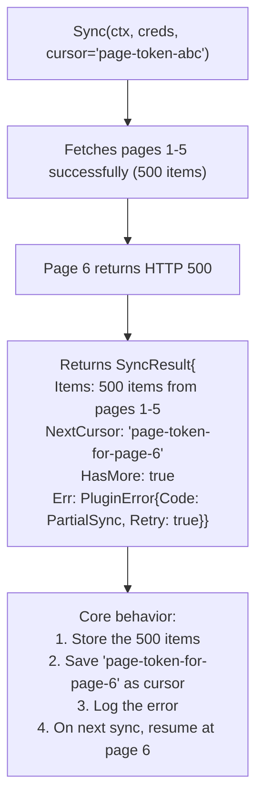
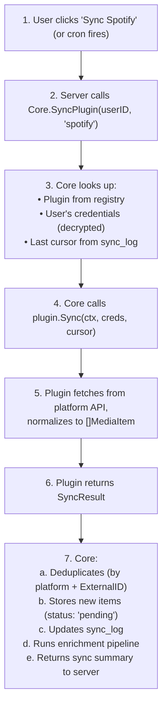

# Plugin Guide

## Overview

Every media data source (Spotify, YouTube, Netflix, etc.) is a **plugin** that implements
a common interface. Core knows nothing about any specific platform — it only knows how
to invoke plugins, store their output, and manage their state.

Plugins are:
- **Compile-time registered** — imported and registered in `main.go`, built into the binary
- **Stateless** — no DB access, no side effects beyond calling their platform's API
- **Responsible for normalization** — raw platform data → `[]MediaItem`
- **Responsible for error mapping** — platform errors → normalized `PluginError`

---

## Plugin Interface

```go
// SourcePlugin is the interface every media source must implement.
type SourcePlugin interface {
    // Name returns the unique identifier for this plugin (e.g., "spotify", "youtube").
    Name() string

    // AuthType returns how this plugin authenticates with its platform.
    AuthType() AuthType

    // AuthConfig returns OAuth configuration if AuthType is OAuth.
    // Returns nil for non-OAuth plugins.
    AuthConfig() *OAuthConfig

    // Sync fetches media items from the platform.
    // Core provides credentials and the cursor from the last successful sync.
    // An empty cursor means first sync (full fetch).
    Sync(ctx context.Context, creds Credentials, cursor string) SyncResult

    // Enrich adds platform-specific tags and metadata using external APIs
    // (e.g., Spotify plugin calls Last.fm, Netflix plugin calls TMDB).
    // Core runs universal LLM enrichment separately after this.
    // Optional — return items unchanged if no platform-specific enrichment is needed.
    Enrich(ctx context.Context, creds Credentials, items []MediaItem) ([]MediaItem, error)
}
```

---

## Core Types

### AuthType

```go
type AuthType int

const (
    AuthOAuth      AuthType = iota  // Platform OAuth flow (Spotify, YouTube)
    AuthFileImport                   // User uploads an export file (Netflix CSV, TikTok JSON)
    AuthAPIKey                       // User provides an API key
    AuthNone                         // No auth needed
)
```

### OAuthConfig

```go
// OAuthConfig defines the OAuth parameters for a plugin.
// Core uses this to initiate the OAuth flow and handle callbacks.
type OAuthConfig struct {
    ProviderName string   // Display name (e.g., "Spotify")
    AuthURL      string   // Authorization endpoint
    TokenURL     string   // Token exchange endpoint
    Scopes       []string // Required OAuth scopes
    // OAuth callback is handled by a server-owned route such as:
    // /connect/{plugin-name}/callback
    // Client-facing initiation goes through /api/v1/plugins/{plugin-name}/connect.
}
```

### Credentials

```go
// Credentials are passed to plugins by core. The plugin never stores these.
type Credentials struct {
    // OAuth plugins
    AccessToken  string
    RefreshToken string

    // File import plugins
    File io.Reader

    // API key plugins
    APIKey string
}
```

### MediaItem

```go
// MediaItem is the normalized representation of any consumed media.
type MediaItem struct {
    Platform    string            // "spotify", "youtube", "netflix", etc.
    Type        MediaType         // Music, Video, Article, Podcast
    Title       string
    Creator     string            // artist, channel, author
    ConsumedAt  time.Time
    Duration    *time.Duration    // how long the content is (nil if unknown)
    TimeSpent   *time.Duration    // how long the user engaged (nil if unknown)
    Tags        []string          // genre, topic, mood — plugin can pre-populate
    URL         string            // link back to original content
    ExternalID  string            // platform-specific ID for dedup
    RawMetadata map[string]any    // platform-specific fields, stored as jsonb
}

type MediaType string

const (
    MediaMusic   MediaType = "music"
    MediaVideo   MediaType = "video"
    MediaArticle MediaType = "article"
    MediaPodcast MediaType = "podcast"
)
```

### SyncResult

```go
// SyncResult is returned by Sync(). Supports partial success and incremental sync.
type SyncResult struct {
    Items      []MediaItem  // items fetched (may be partial on error)
    NextCursor string       // opaque cursor for incremental sync — core stores and replays
    HasMore    bool         // true if pagination was not exhausted
    Err        *PluginError // nil on full success
}
```

The cursor is **opaque to core** — each plugin encodes whatever it needs:
- Spotify: a timestamp of the last fetched track
- YouTube: a page token from the API
- Netflix: ignored (file imports are always full)

Core stores `NextCursor` after a successful (or partial) sync and passes it back
on the next `Sync()` call. An empty cursor signals a first-time full fetch.

---

## Error Handling

### PluginError

```go
// PluginError is the normalized error type all plugins must use.
type PluginError struct {
    Code    ErrorCode     // normalized error category
    Message string        // human-readable description
    Retry   bool          // should core retry this operation?
    After   time.Duration // retry delay hint (for rate limits)
    Raw     error         // original platform-specific error (for logging)
}

func (e *PluginError) Error() string {
    return fmt.Sprintf("[%s] %s", e.Code, e.Message)
}
```

### Error Codes

| Code | Meaning | Core Behavior |
|------|---------|---------------|
| `AuthExpired` | Token needs refresh or re-auth | Attempt token refresh via OAuth. If refresh fails, mark plugin as disconnected and notify user. |
| `RateLimit` | Hit platform API rate limit | Back off, retry after `After` duration. Do not count as sync failure. |
| `PartialSync` | Got some items, then failed | Store returned items, save cursor, log the error. Resume from cursor on next sync. |
| `Upstream` | Platform API error (500, timeout, etc.) | Retry with exponential backoff. After max retries, log and surface to user. |
| `InvalidData` | Unexpected response format | Log with raw response, don't retry. Flag for investigation. |
| `PermissionDenied` | Insufficient OAuth scopes | Notify user to re-authorize with correct scopes. Show which scopes are missing. |
| `FileParseError` | Import file is malformed | Return error with line/position info. User must fix and re-upload. |

```go
type ErrorCode string

const (
    ErrAuthExpired      ErrorCode = "auth_expired"
    ErrRateLimit        ErrorCode = "rate_limit"
    ErrPartialSync      ErrorCode = "partial_sync"
    ErrUpstream         ErrorCode = "upstream"
    ErrInvalidData      ErrorCode = "invalid_data"
    ErrPermissionDenied ErrorCode = "permission_denied"
    ErrFileParseError   ErrorCode = "file_parse_error"
)
```

### Partial Sync Flow



---

## Plugin Lifecycle

### Registration (compile-time)

```go
// In main.go or an init package
func main() {
    registry := core.NewPluginRegistry()

    registry.Register(spotify.New())
    registry.Register(youtube.New())
    registry.Register(netflix.New())

    // ... start server with registry
}
```

Plugins are registered once at startup. The registry validates that names are unique
and that OAuth plugins provide a valid `OAuthConfig`.

### Sync Lifecycle (per user)



### Deduplication

Core deduplicates using `(user_id, platform, external_id)` as a unique key.
If an item already exists:
- **Skip** — don't insert a duplicate
- **Update** — if `RawMetadata` has changed (optional, configurable per plugin)

Plugins must populate `ExternalID` with a stable platform-specific identifier
(e.g., Spotify track URI, YouTube video ID, Netflix title ID).

---

## Writing a Plugin

### Minimal Example: Netflix CSV Import

```go
package netflix

import (
    "context"
    "encoding/csv"
    "io"
    "time"

    "media-consumption-analysis/internal/core"
)

type Plugin struct{}

func New() *Plugin { return &Plugin{} }

func (p *Plugin) Name() string           { return "netflix" }
func (p *Plugin) AuthType() core.AuthType { return core.AuthFileImport }
func (p *Plugin) AuthConfig() *core.OAuthConfig { return nil }

func (p *Plugin) Sync(ctx context.Context, creds core.Credentials, cursor string) core.SyncResult {
    // File imports ignore cursor — always process the full file
    reader := csv.NewReader(creds.File)
    records, err := reader.ReadAll()
    if err != nil {
        return core.SyncResult{
            Err: &core.PluginError{
                Code:    core.ErrFileParseError,
                Message: "failed to parse Netflix CSV: " + err.Error(),
                Raw:     err,
            },
        }
    }

    var items []core.MediaItem
    for i, record := range records {
        if i == 0 {
            continue // skip header
        }

        consumedAt, _ := time.Parse("1/2/06", record[1])

        items = append(items, core.MediaItem{
            Platform:   "netflix",
            Type:       core.MediaVideo,
            Title:      record[0],
            ConsumedAt: consumedAt,
            ExternalID: record[0] + "|" + record[1], // title + date as dedup key
            RawMetadata: map[string]any{
                "raw_title": record[0],
            },
        })
    }

    return core.SyncResult{
        Items:   items,
        HasMore: false,
    }
}

func (p *Plugin) Enrich(ctx context.Context, creds core.Credentials, items []core.MediaItem) ([]core.MediaItem, error) {
    // No platform-specific enrichment for Netflix CSV
    return items, nil
}
```

### OAuth Example: Spotify (skeleton)

```go
package spotify

import (
    "context"
    "encoding/json"
    "fmt"
    "net/http"
    "time"

    "media-consumption-analysis/internal/core"
)

type Plugin struct {
    client *http.Client
}

func New() *Plugin {
    return &Plugin{client: &http.Client{}}
}

func (p *Plugin) Name() string           { return "spotify" }
func (p *Plugin) AuthType() core.AuthType { return core.AuthOAuth }

func (p *Plugin) AuthConfig() *core.OAuthConfig {
    return &core.OAuthConfig{
        ProviderName: "Spotify",
        AuthURL:      "https://accounts.spotify.com/authorize",
        TokenURL:     "https://accounts.spotify.com/api/token",
        Scopes:       []string{"user-read-recently-played", "user-library-read"},
    }
}

func (p *Plugin) Sync(ctx context.Context, creds core.Credentials, cursor string) core.SyncResult {
    // cursor is a Unix timestamp (last fetched track's played_at)
    var after int64
    if cursor != "" {
        fmt.Sscanf(cursor, "%d", &after)
    }

    url := fmt.Sprintf(
        "https://api.spotify.com/v1/me/player/recently-played?limit=50&after=%d",
        after,
    )

    req, _ := http.NewRequestWithContext(ctx, "GET", url, nil)
    req.Header.Set("Authorization", "Bearer "+creds.AccessToken)

    resp, err := p.client.Do(req)
    if err != nil {
        return core.SyncResult{
            Err: &core.PluginError{
                Code:    core.ErrUpstream,
                Message: "failed to reach Spotify API",
                Retry:   true,
                Raw:     err,
            },
        }
    }
    defer resp.Body.Close()

    if resp.StatusCode == 401 {
        return core.SyncResult{
            Err: &core.PluginError{
                Code:    core.ErrAuthExpired,
                Message: "Spotify access token expired",
            },
        }
    }

    if resp.StatusCode == 429 {
        retryAfter, _ := time.ParseDuration(resp.Header.Get("Retry-After") + "s")
        return core.SyncResult{
            Err: &core.PluginError{
                Code:    core.ErrRateLimit,
                Message: "Spotify rate limit hit",
                Retry:   true,
                After:   retryAfter,
            },
        }
    }

    // Parse response, normalize to []MediaItem, set NextCursor...
    // (implementation details omitted for brevity)

    return core.SyncResult{
        Items:      nil, // TODO: parse and normalize
        NextCursor: "",  // TODO: latest played_at as unix timestamp
        HasMore:    false,
    }
}

func (p *Plugin) Enrich(ctx context.Context, creds core.Credentials, items []core.MediaItem) ([]core.MediaItem, error) {
    // Could fetch audio features, artist genres, etc. from Spotify API
    return items, nil
}
```

---

## Plugin Checklist

When building a new plugin, ensure:

- [ ] Implements `SourcePlugin` interface fully
- [ ] `Name()` returns a unique, lowercase identifier
- [ ] `ExternalID` is populated with a stable platform-specific ID
- [ ] All platform API errors are mapped to `PluginError` codes
- [ ] Partial sync returns items collected so far + cursor for resumption
- [ ] `Sync()` respects `ctx` cancellation
- [ ] `Sync()` handles empty cursor (first sync) vs populated cursor (incremental)
- [ ] File import plugins validate file format and return `FileParseError` with details
- [ ] OAuth plugins specify minimum required scopes in `AuthConfig()`
- [ ] `RawMetadata` includes platform-specific fields that might be useful for enrichment
- [ ] Plugin is registered in `main.go`

---

## Testing Plugins

Plugins are stateless and have no DB dependency, making them straightforward to test:

```go
func TestSpotifySync(t *testing.T) {
    // Mock HTTP server returning canned Spotify API responses
    server := httptest.NewServer(http.HandlerFunc(func(w http.ResponseWriter, r *http.Request) {
        // Return mock recently-played response
    }))
    defer server.Close()

    plugin := spotify.NewWithBaseURL(server.URL)
    result := plugin.Sync(context.Background(), core.Credentials{
        AccessToken: "test-token",
    }, "")

    assert.Nil(t, result.Err)
    assert.Len(t, result.Items, 50)
    assert.Equal(t, "spotify", result.Items[0].Platform)
    assert.NotEmpty(t, result.Items[0].ExternalID)
}

func TestNetflixParseError(t *testing.T) {
    plugin := netflix.New()
    result := plugin.Sync(context.Background(), core.Credentials{
        File: strings.NewReader("not,valid,csv\n\"unclosed),
    }, "")

    assert.NotNil(t, result.Err)
    assert.Equal(t, core.ErrFileParseError, result.Err.Code)
}
```

Key testing patterns:
- **OAuth plugins**: Use `httptest.Server` to mock platform APIs. Provide a `NewWithBaseURL()` constructor.
- **File import plugins**: Pass `strings.NewReader()` or fixture files as `creds.File`.
- **Error paths**: Test each `ErrorCode` the plugin can return.
- **Cursor behavior**: Test first sync (empty cursor) and incremental sync (with cursor).
