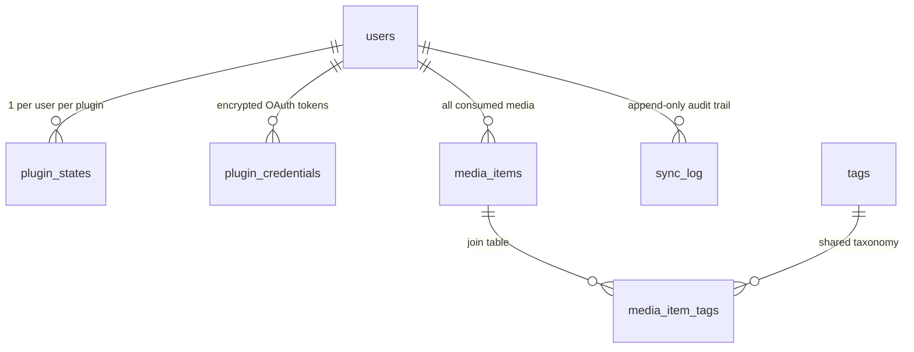
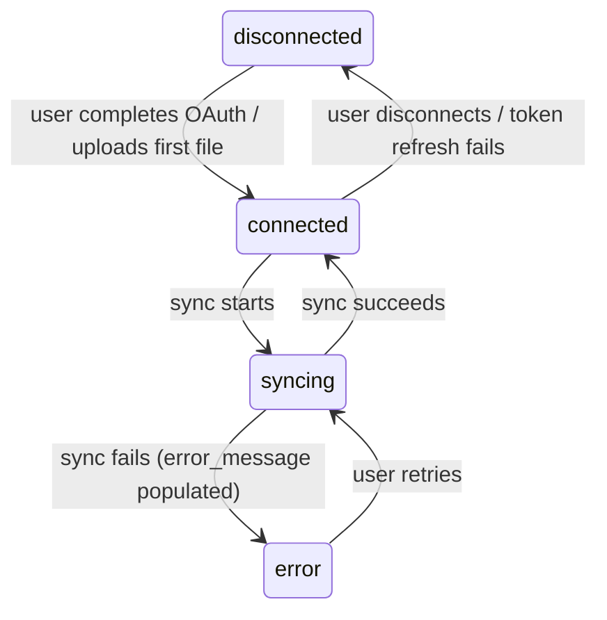

# Schema

## Overview

PostgreSQL database with the following design principles:

- **All data scoped by `user_id`** — no query touches the DB without it
- **Platform-specific data in `raw_metadata` (jsonb)** — structured columns only for universal fields
- **Normalized tags** — separate tables for taxonomy, aliases, and per-item associations
- **Plugin state separated from sync history** — current state vs audit trail
- **Timestamps in UTC** — always `timestamptz`

---

## ER Diagram



---

## Tables

### `users`

User accounts. Auth via Google/GitHub OAuth only.

```sql
CREATE TABLE users (
    id            UUID PRIMARY KEY DEFAULT gen_random_uuid(),
    email         TEXT NOT NULL UNIQUE,
    display_name  TEXT NOT NULL,
    avatar_url    TEXT,
    auth_provider TEXT NOT NULL,           -- "google", "github"
    auth_subject  TEXT NOT NULL,           -- provider's unique user ID
    profile_slug  TEXT UNIQUE,             -- for shareable profile URLs (/share/{slug})
    created_at    TIMESTAMPTZ NOT NULL DEFAULT now(),
    updated_at    TIMESTAMPTZ NOT NULL DEFAULT now(),

    UNIQUE (auth_provider, auth_subject)
);
```

**Notes:**
- `auth_provider` + `auth_subject` uniquely identifies a user from an OAuth provider
- `profile_slug` is optional — set when user enables sharing (M7)
- A user could potentially link multiple OAuth providers in the future (add a
  `user_auth_methods` table), but for MVP one provider per user is fine

### `plugin_states`

Current state of each plugin per user. One row per user per plugin.

```sql
CREATE TABLE plugin_states (
    id            UUID PRIMARY KEY DEFAULT gen_random_uuid(),
    user_id       UUID NOT NULL REFERENCES users(id) ON DELETE CASCADE,
    plugin        TEXT NOT NULL,           -- "spotify", "youtube", "netflix"
    status        TEXT NOT NULL DEFAULT 'disconnected',
                                           -- "connected", "disconnected", "error", "syncing"
    enabled       BOOLEAN NOT NULL DEFAULT true,
    cursor        TEXT,                    -- opaque cursor for incremental sync
    last_synced_at TIMESTAMPTZ,
    error_message TEXT,                    -- last error (if status = 'error')
    created_at    TIMESTAMPTZ NOT NULL DEFAULT now(),
    updated_at    TIMESTAMPTZ NOT NULL DEFAULT now(),

    UNIQUE (user_id, plugin)
);

CREATE INDEX idx_plugin_states_user ON plugin_states(user_id);
```

**Status transitions:**


### `plugin_credentials`

Encrypted OAuth tokens and API keys per user per plugin.

```sql
CREATE TABLE plugin_credentials (
    id            UUID PRIMARY KEY DEFAULT gen_random_uuid(),
    user_id       UUID NOT NULL REFERENCES users(id) ON DELETE CASCADE,
    plugin        TEXT NOT NULL,
    auth_type     TEXT NOT NULL,           -- "oauth", "api_key", "file_import"
    encrypted_data BYTEA NOT NULL,         -- encrypted JSON blob of credentials
    expires_at    TIMESTAMPTZ,             -- token expiry (if applicable)
    created_at    TIMESTAMPTZ NOT NULL DEFAULT now(),
    updated_at    TIMESTAMPTZ NOT NULL DEFAULT now(),

    UNIQUE (user_id, plugin)
);

CREATE INDEX idx_plugin_credentials_user ON plugin_credentials(user_id);
```

**Notes:**
- Credentials are encrypted at rest using an application-level encryption key
- The `encrypted_data` blob contains the JSON-encoded `Credentials` struct
  (access token, refresh token, etc.) — decrypted only when passed to a plugin
- File import plugins may have no stored credentials (auth_type = 'file_import')
- `expires_at` allows core to proactively refresh tokens before they expire

### `media_items`

Normalized consumption data. The core table.

```sql
CREATE TABLE media_items (
    id            UUID PRIMARY KEY DEFAULT gen_random_uuid(),
    user_id       UUID NOT NULL REFERENCES users(id) ON DELETE CASCADE,
    platform      TEXT NOT NULL,           -- "spotify", "youtube", "netflix"
    type          TEXT NOT NULL,           -- "music", "video", "article", "podcast"
    title         TEXT NOT NULL,
    creator       TEXT,                    -- artist, channel, author
    consumed_at   TIMESTAMPTZ NOT NULL,
    duration      INTERVAL,               -- content length (NULL if unknown)
    time_spent    INTERVAL,               -- actual engagement time (NULL if unknown)
    url           TEXT,                    -- link back to original content
    external_id   TEXT NOT NULL,           -- platform-specific ID for dedup
    enrichment_status TEXT NOT NULL DEFAULT 'pending',
                                           -- "pending", "enriched", "failed"
    raw_metadata  JSONB DEFAULT '{}',     -- platform-specific fields
    created_at    TIMESTAMPTZ NOT NULL DEFAULT now(),
    updated_at    TIMESTAMPTZ NOT NULL DEFAULT now(),

    UNIQUE (user_id, platform, external_id)
);

-- Primary query patterns
CREATE INDEX idx_media_items_user_consumed ON media_items(user_id, consumed_at DESC);
CREATE INDEX idx_media_items_user_platform ON media_items(user_id, platform);
CREATE INDEX idx_media_items_user_type ON media_items(user_id, type);
CREATE INDEX idx_media_items_enrichment ON media_items(enrichment_status) WHERE enrichment_status = 'pending';

-- For full-text search on titles/creators
CREATE INDEX idx_media_items_search ON media_items USING gin(
    to_tsvector('english', coalesce(title, '') || ' ' || coalesce(creator, ''))
);
```

**Notes:**
- `(user_id, platform, external_id)` is the dedup key — prevents duplicate imports
- `enrichment_status` tracks whether the item has been through the enrichment pipeline
- `raw_metadata` stores anything platform-specific: Spotify audio features, YouTube
  video categories, Netflix series info, etc.
- `consumed_at` is the primary sort axis for timeline views
- Full-text search index enables searching across all your media

### `tags`

Shared tag taxonomy. Tags are global (not per-user) to enable consistent categorization.

```sql
CREATE TABLE tags (
    id            UUID PRIMARY KEY DEFAULT gen_random_uuid(),
    name          TEXT NOT NULL UNIQUE,    -- normalized lowercase: "hip-hop", "comedy", "science"
    category      TEXT,                    -- "genre", "mood", "topic", "era", etc.
    created_at    TIMESTAMPTZ NOT NULL DEFAULT now()
);

CREATE INDEX idx_tags_category ON tags(category);
CREATE INDEX idx_tags_name ON tags(name);
```

### `tag_aliases`

Maps variant spellings/names to canonical tags.

```sql
CREATE TABLE tag_aliases (
    id            UUID PRIMARY KEY DEFAULT gen_random_uuid(),
    alias         TEXT NOT NULL UNIQUE,    -- "hip hop", "hiphop", "Hip-Hop"
    tag_id        UUID NOT NULL REFERENCES tags(id) ON DELETE CASCADE,
    created_at    TIMESTAMPTZ NOT NULL DEFAULT now()
);

CREATE INDEX idx_tag_aliases_alias ON tag_aliases(alias);
```

**Notes:**
- When enrichers produce a tag string, core checks `tag_aliases` first, then `tags`
- This allows merging "hip-hop", "hip hop", "Hip Hop" into one canonical tag
- Aliases can be managed manually or seeded from platform genre mappings

### `media_item_tags`

Join table associating media items with tags.

```sql
CREATE TABLE media_item_tags (
    media_item_id UUID NOT NULL REFERENCES media_items(id) ON DELETE CASCADE,
    tag_id        UUID NOT NULL REFERENCES tags(id) ON DELETE CASCADE,
    source        TEXT NOT NULL,           -- "spotify", "lastfm", "llm", "youtube", "manual"
    confidence    REAL,                    -- 0.0-1.0 for LLM-generated tags (NULL for authoritative)
    created_at    TIMESTAMPTZ NOT NULL DEFAULT now(),

    PRIMARY KEY (media_item_id, tag_id, source)
);

CREATE INDEX idx_media_item_tags_tag ON media_item_tags(tag_id);
CREATE INDEX idx_media_item_tags_item ON media_item_tags(media_item_id);
```

**Notes:**
- `source` tracks where the tag came from — useful for debugging and confidence
- `confidence` allows filtering out low-confidence LLM tags in insights
- Primary key includes `source` so the same tag can be applied by multiple enrichers
  (e.g., both Spotify and Last.fm agree it's "rock")
- This powers queries like "show me all items tagged 'science' with confidence > 0.8"

### `sync_log`

Append-only audit trail. Never queried for current state (that's `plugin_states`).

```sql
CREATE TABLE sync_log (
    id            UUID PRIMARY KEY DEFAULT gen_random_uuid(),
    user_id       UUID NOT NULL REFERENCES users(id) ON DELETE CASCADE,
    plugin        TEXT NOT NULL,
    started_at    TIMESTAMPTZ NOT NULL DEFAULT now(),
    completed_at  TIMESTAMPTZ,
    items_added   INTEGER DEFAULT 0,
    items_skipped INTEGER DEFAULT 0,      -- duplicates that were deduped
    items_updated INTEGER DEFAULT 0,      -- existing items with updated metadata
    status        TEXT NOT NULL DEFAULT 'running',
                                           -- "running", "success", "partial", "failed"
    error_code    TEXT,                    -- normalized PluginError code
    error_message TEXT,
    duration_ms   INTEGER                 -- sync duration in milliseconds
);

CREATE INDEX idx_sync_log_user_plugin ON sync_log(user_id, plugin, started_at DESC);
```

---

## Query Patterns

### Timeline (dashboard home)

```sql
SELECT mi.*, array_agg(DISTINCT t.name) AS tags
FROM media_items mi
LEFT JOIN media_item_tags mit ON mi.id = mit.media_item_id
LEFT JOIN tags t ON mit.tag_id = t.id
WHERE mi.user_id = $1
  AND mi.consumed_at BETWEEN $2 AND $3
GROUP BY mi.id
ORDER BY mi.consumed_at DESC
LIMIT 50 OFFSET $4;
```

### Topic distribution (insights)

```sql
SELECT t.name, t.category, COUNT(*) AS count
FROM media_item_tags mit
JOIN tags t ON mit.tag_id = t.id
JOIN media_items mi ON mit.media_item_id = mi.id
WHERE mi.user_id = $1
  AND mi.consumed_at BETWEEN $2 AND $3
  AND (mit.confidence IS NULL OR mit.confidence >= 0.7)
GROUP BY t.name, t.category
ORDER BY count DESC
LIMIT 20;
```

### Platform breakdown (insights)

```sql
SELECT platform, type, COUNT(*) AS count,
       SUM(EXTRACT(EPOCH FROM duration)) AS total_duration_sec
FROM media_items
WHERE user_id = $1
  AND consumed_at BETWEEN $2 AND $3
GROUP BY platform, type
ORDER BY count DESC;
```

### Items pending enrichment

```sql
SELECT * FROM media_items
WHERE enrichment_status = 'pending'
ORDER BY created_at ASC
LIMIT 100;
```

---

## Migration Strategy

Use [goose](https://github.com/pressly/goose) for SQL migrations:

```
migrations/
├── 001_create_users.sql
├── 002_create_plugin_states.sql
├── 003_create_plugin_credentials.sql
├── 004_create_media_items.sql
├── 005_create_tags.sql
├── 006_create_tag_aliases.sql
├── 007_create_media_item_tags.sql
└── 008_create_sync_log.sql
```

**Principles:**
- One table per migration for clean rollbacks
- Migrations are sequential and forward-only in production
- Each migration includes both `up` and `down` (for development)
- Schema changes that affect indexes should be in their own migration
- Use `goose` embedded in the binary — run migrations on startup in dev,
  explicitly in production

---

## Encryption

Plugin credentials are encrypted using AES-256-GCM:

- Application-level encryption key stored in environment variable (`ENCRYPTION_KEY`)
- Each credential blob has its own nonce
- Key rotation: re-encrypt all credentials with new key, update env var
- Core decrypts credentials only when passing them to a plugin's `Sync()` or `Enrich()`

```go
// Simplified — actual implementation in internal/core/store/crypto.go
func Encrypt(plaintext []byte, key []byte) ([]byte, error)
func Decrypt(ciphertext []byte, key []byte) ([]byte, error)
```
